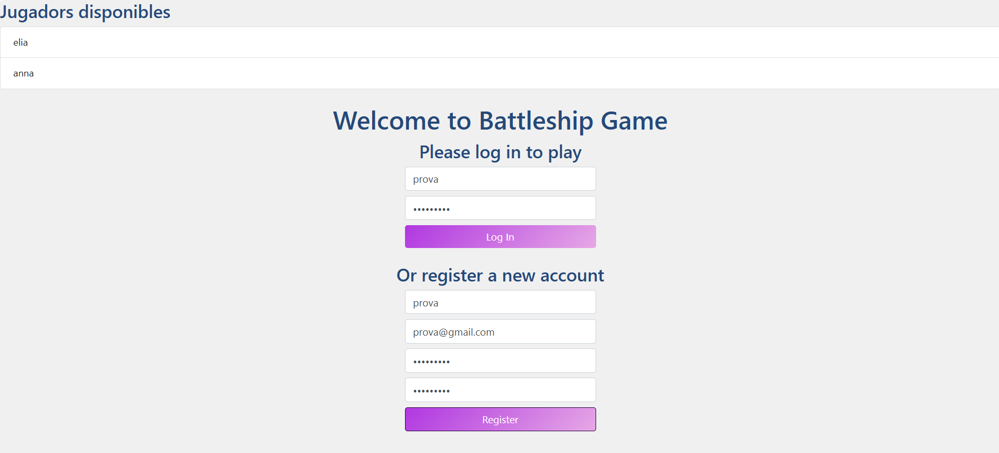
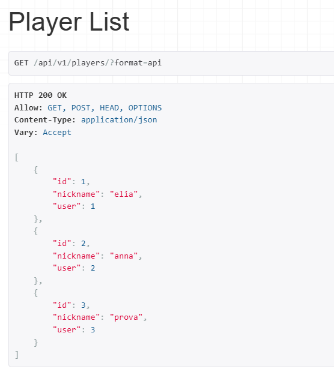
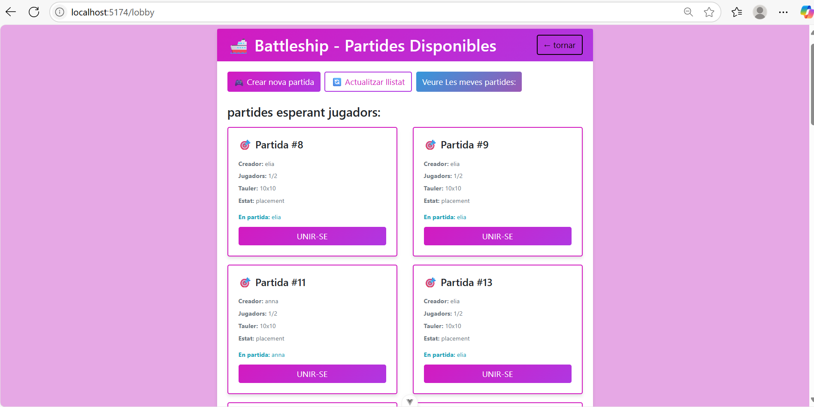
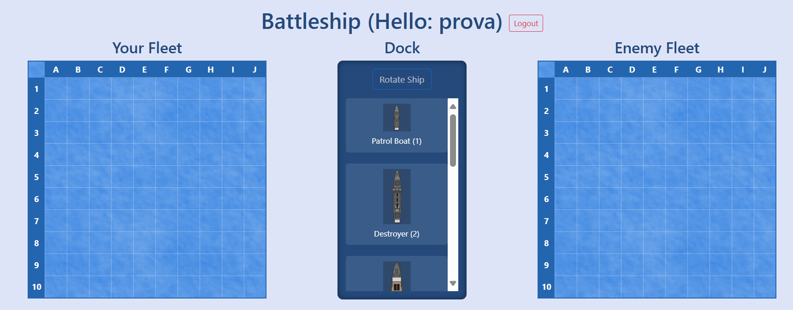
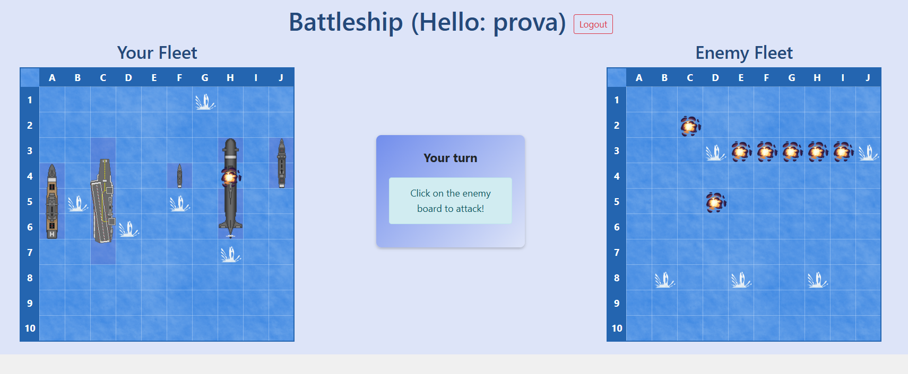
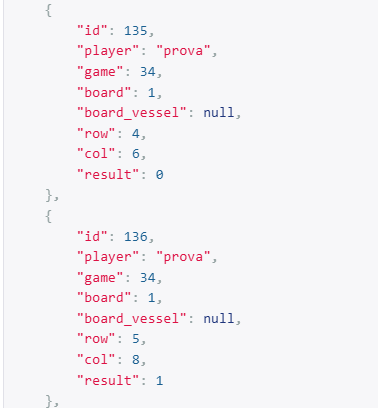
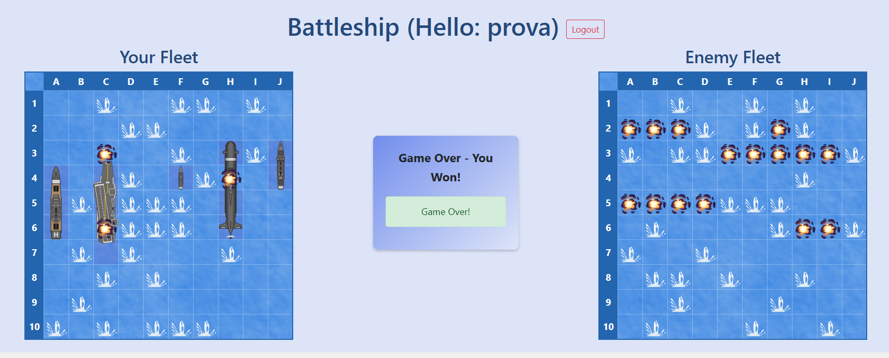
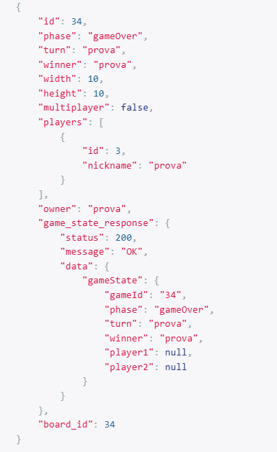

# Captures de Funcionament

Aquest apartat descriu les captures de pantalla que mostren el funcionament final del joc d'enfonsar la flota, cobrint les funcionalitats principals de la pràctica.

---

## Pantalla de registre:

- **Descripció:** Mostra el formulari de registre d'usuaris, amb camps per a nom d'usuari, correu electrònic i contrasenya. 
- Desde backend veient en la llista de players com s'ha afegit correctament:

---

## Pantalla de GameLobby:

- **Descripció:** Mostra el GameLobby on estan les partides ja començades i et pots unir a elles.  

---

## Interfície de col·locació de vaixells:

- **Descripció:** Mostra el tauler del jugador (10x10) amb una llista de vaixells disponibles.  

---

## Fase de joc:

- **Descripció:** Mostra els dos taulers: el del jugador (amb vaixells col·locats i tirs rebuts del bot) i el de l'oponent (amb tirs realitzats per l'usuari.  

- També si mirem el backend veiem que shots es va actualitzant cada cop que realitzem un.

---

## Pantalla de fi del joc:

- **Descripció:** Mostra la pantalla de "Game Over", amb un missatge indicant el guanyador. 

- Desde backend en games veiem com s'actualitza el gameState amb el winner i la phase correcte.

